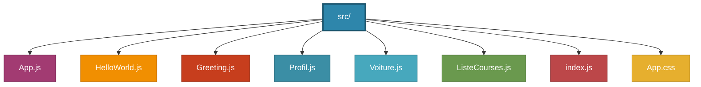

# TP React - Création d'une application avec des composants fonctionnels

## Objectif
Ce TP vise à consolider les connaissances en React par la création d'une petite application étape par étape. À la fin de ce TP, vous serez capable de :

- Initialiser un projet React avec Create React App
- Créer et intégrer des composants fonctionnels avec JSX
- Utiliser les props pour transmettre des données entre composants
- Structurer efficacement une application React

## Étapes réalisées

### Étape 1 : Préparation de l'environnement
-  Installation de Node.js v22.21.0 et npm v10.9.4
-  Création du projet React avec `npx create-react-app tp-react`
-  Démarrage du serveur de développement

### Étape 2 : Composants fonctionnels simples
-  Création du composant `HelloWorld` affichant un message simple

### Étape 3 : Utilisation des props
-  Création du composant `Greeting` qui prend une prop `prenom`
-  Affichage de messages personnalisés

### Étape 4 : Composants avancés avec PropTypes
-  Installation de la bibliothèque `prop-types`
-  Création du composant `Profil` avec validation des props
-  Utilisation d'images et de props par défaut

### Étape 5 : Exercices pratiques
-  Création du composant `Voiture` avec validation des props
-  Création du composant `ListeCourses` pour afficher des listes dynamiques

##  Structure du projet


##  Composants créés
### HelloWorld
```jsx
<HelloWorld />
```
Affiche un simple message "Hello World !"

### Greeting
```jsx
<Greeting prenom="Alice" />
```
Affiche un message personnalisé avec le prénom passé en prop.

### Profil
```jsx
<Profil utilisateur={{nom: 'Emma', photo: '/user.png'}} taille={150} />
```
Affiche une image de profil avec validation des types.

### Voiture
```jsx
<Voiture marque="Renault" modele="Clio" couleur="rouge" />
```
Affiche les informations d'une voiture avec validation des props.

### ListeCourses
```jsx
<ListeCourses elements={['Pommes', 'Bananes', 'Lait']} />
```
Affiche une liste dynamique d'éléments.


### Lancement du projet

#### Installation des dépendances
npm install

#### Démarrage du serveur de développement
npm start

#### Construction pour la production
npm run build


## Auteur
**Arroche Aya**

